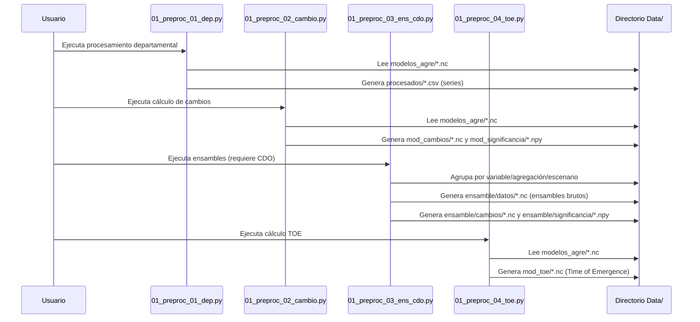
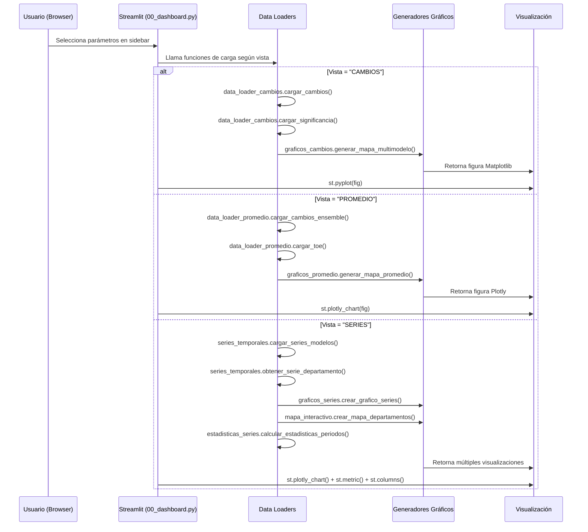

# 🌍 Dashboard de Análisis Climático Multimodelo - SMN

## 📋 Descripción General

Este repositorio aloja el **Dashboard de Análisis Climático Multimodelo**, una herramienta integral desarrollada para la **Subdirección de Modelamiento Numérico (SMN)** del SENAMHI. El sistema permite visualizar, analizar y comparar proyecciones climáticas (CMIP6) para Perú, combinando un procesamiento científico robusto (backend batch) con visualizaciones interactivas en tiempo real (frontend Streamlit).

---

## 🚀 Parte 1: Para el Usuario Final

### 🎯 Objetivos del Sistema
Proporcionar una interfaz intuitiva para explorar:
- **Proyecciones de Cambio Climático:** Visualización espacial de anomalías (Futuro - Histórico) en temperatura y precipitación bajo escenarios SSP245 y SSP585.
- **Consenso Científico:** Generación de ensambles multimodelo para reducir la incertidumbre individual de los modelos globales.
- **Análisis Estadístico:** Evaluación de la robustez de las señales mediante pruebas de significancia (T-Student).
- **Time of Emergence (TOE):** Identificación del año exacto en que la señal de cambio climático emerge permanentemente sobre la variabilidad natural del clima.
- **Escala Subnacional:** Desglose de información (series temporales y estadísticas) a nivel departamental para la toma de decisiones locales.

### 🖥️ Navegación en el Dashboard

#### 📊 Vistas Disponibles:

1. **INICIO GENERAL (🏠)**
   - Punto de entrada con instrucciones detalladas
   - Descripción de funcionalidades disponibles
   - No requiere configuración previa

2. **PROMEDIO (🌍)**
   - **Objetivo**: Visualizar consenso multimodelo
   - **Salidas**: 
     - Mapa 1: Cambios SSP245 (escenario moderado)
     - Mapa 2: Cambios SSP585 (escenario severo)
     - Mapa 3: TOE (año de emergencia de la señal climática)
   - **Beneficio**: Identificación rápida de zonas críticas con acuerdo multimodelo

3. **CAMBIOS**
   - **Objetivo**: Comparar proyecciones individuales de modelos
   - **Configuración requerida**:
     - Modelos (selección múltiple)
     - Variable + Agregación temporal
     - Periodo de referencia
     - Año centro + Escenario
   - **Beneficio**: Análisis detallado de incertidumbre intermodelo

4. **SERIES**
   - **Objetivo**: Analizar evolución temporal por departamento
   - **Componentes**:
     - Gráfico de series temporales (modelos + promedio)
     - Estadísticas comparativas periodos base/futuro
     - Mapas de ubicación departamental
   - **Beneficio**: Evaluación de impactos a escala subnacional

### 🎮 Controles Principales

| Control | Función | Valores Típicos |
|---------|---------|-----------------|
| **Modelos** | Selección de modelos climáticos | ecmwf-51, ncep-2, etc. |
| **Variable y Agregación** | Variable climática + escala temporal | tasmin_ANUAL, pr_DEF, tasmax_MAM |
| **Periodo base** | Línea de referencia climática | 1981-2010, 1991-2020 |
| **Año centro y Escenario** | Periodo futuro + trayectoria socioeconómica | 2050_ssp585, 2030_ssp245 |
| **Significancia** | Filtro estadístico (p < 0.05) | Activado/Desactivado |
| **Departamento** | Unidad subnacional para series | Lima, Cusco, Loreto, etc. |

---

## 🔧 Parte 2: Para el Desarrollador/Analista

## 🏗️ Arquitectura del Flujo de Procesamiento

Este diagrama ilustra el flujo de datos y procesamiento, dividido en las cuatro capas principales de la aplicación.

```mermaid
graph TD
    %% Estilos para simplificar la visualización en el README
    classDef layer style fill:#f9f,stroke:#333,stroke-width:2px,color:#000;
    classDef data style fill:#def,stroke:#333,stroke-width:2px,color:#000;
    classDef proc style fill:#dff,stroke:#333,stroke-width:2px,color:#000;
    classDef viz style fill:#ffd,stroke:#333,stroke-width:2px,color:#000;
    classDef aux style fill:#eee,stroke:#999,stroke-width:1px,color:#333;

    %% ===== CAPA DE DATOS (Input) =====
    subgraph A[1. CAPA DE DATOS (INPUT)]
        A1[Modelos Climáticos NetCDF y Geospatiales]:::data
    end
    
    %% ===== CAPA DE PROCESAMIENTO (Scripts) =====
    subgraph B[2. CAPA DE PROCESAMIENTO]
        B1[Scripts de Preprocesamiento (01_preproc_*.py)]:::proc
        B2[Resultados Procesados (CSV, Cambios, Ensambles, TOEs)]:::data
    end
    
    %% ===== CAPA DE VISUALIZACIÓN (Output) =====
    subgraph C[3. CAPA DE VISUALIZACIÓN (DASHBOARD)]
        C1[00_dashboard.py (Streamlit)]:::viz
        C2[Mapas y Gráficos Interactivos]:::viz
    end
    
    %% ===== CAPA DE MÓDULOS AUXILIARES (Soporte) =====
    subgraph D[4. MÓDULOS AUXILIARES (src/*)]
        D1[Lógica de Utilidades, Carga de Datos y Algoritmos Científicos]:::aux
    end
    
    %% ===== FLUJO PRINCIPAL DE DATOS =====
    A1 --> B1
    B1 --> B2
    B2 --> C1
    C1 --> C2
    
    %% ===== CONEXIONES DE SOPORTE =====
    D1 -.-> B1
    D1 -.-> C1
    
    %% Indicadores de las capas para el README
    A[CAPA DE DATOS]:::layer
    B[CAPA DE PROCESAMIENTO]:::layer
    C[CAPA DE VISUALIZACIÓN]:::layer
    D[MÓDULOS AUXILIARES]:::layer
``` 
### 📁 Jerarquía de Archivos y Módulos

#### Jerarquía de Datos

``` 
data/
├── geo/
│   └── peru32.geojson            # Polígonos departamentales (EPSG:4326)
├── modelos_agre/                 # [INPUT] NetCDFs de entrada
│   └── {var}_{agg}_{mod}_{ssp}.nc
├── procesados/                   # [OUTPUT] Series temporales (CSV)
│   └── {mod}_{var}_{agg}_{ssp}.csv
├── mod_cambios/                  # [OUTPUT] Deltas por modelo
│   └── {mod}_{var}_{agg}_{ssp}_{base}_centro-{y}.nc
├── mod_significancia/            # [OUTPUT] P-values por modelo
│   └── {mod}_{var}_{agg}_{ssp}_{base}_centro-{y}.npy
├── ensamble/                     # [OUTPUT] Datos del Ensamble
│   ├── datos/                    # Ensamble bruto (CDO)
│   ├── cambios/                  # Deltas del ensamble
│   └── significancia/            # P-values del ensamble
└── mod_toe/                      # [OUTPUT] Time of Emergence
    └── ensemble_{var}_{agg}_toe.nc
```

#### **Nivel 1: Scripts Principales (Orquestación)**
```
00_dashboard.py              # ⭐ CORAZÓN DEL SISTEMA - Interfaz principal
├── 01_preproc_01_dep.py     # 📊 Procesamiento espacial (departamentos)
├── 01_preproc_02_cambio.py  # 🔄 Cálculo de cambios y significancia
├── 01_preproc_03_ens_cdo.py # 🧮 Generación de ensambles (requiere CDO)
└── 01_preproc_04_toe.py     # ⏰ Cálculo de Time of Emergence
```

#### **Nivel 2: Módulos de Negocio (src/)**
```
src/
├── 🧪 ALGORITMOS CIENTÍFICOS
│   ├── aux_cambios_significancia.py  # 📈 Estadísticas básicas
│   ├── aux_ens_cdo.py               # 🔗 Interfaz CDO para ensambles
│   └── aux_calcular_toe.py          # 🎯 Algoritmo TOE (5 partes)
│
├── 💾 CARGA DE DATOS
│   ├── data_loader_cambios.py       # 📂 Cambios por modelo
│   ├── data_loader_promedio.py      # 📦 Datos de ensamble
│   ├── series_temporales.py         # 📊 Series por departamento
│   └── estadisticas_series.py       # 🧮 Cálculo estadístico series
│
├── 🎨 GENERACIÓN DE VISUALIZACIONES
│   ├── graficos_cambios.py          # 🗺️ Mapas de cambios (Matplotlib)
│   ├── graficos_series.py           # 📈 Series temporales (Plotly)
│   ├── graficos_promedio.py         # 🌐 Mapas de promedio (Plotly)
│   └── mapa_interactivo.py          # 📍 Mapas departamentales
│
└── 🛠️ UTILITARIOS
    └── dashboard_utils.py           # 🔧 Funciones auxiliares
```

### 🔄 Flujo de Datos Detallado

#### **Flujo 1: Procesamiento Inicial (Batch)**


#### **Flujo 2: Visualización en Tiempo Real**


### 🧩 Descripción Detallada de Módulos

#### **1. Scripts Principales**

##### `00_dashboard.py` ⭐ Gaea
**Función**: Orquestador principal del sistema
**Utilidad**:
- Unifica todas las visualizaciones en una interfaz coherente
- Gestiona estado de sesión para mejor experiencia de usuario
- Coordina carga de módulos según vista seleccionada
- Aplica estilos CSS personalizados para identidad visual SMN

**Conexiones clave**:
- Importa todos los generadores de gráficos
- Utiliza `dashboard_utils.py` para funcionalidades auxiliares
- Se comunica con todos los data loaders

##### `01_preproc_01_dep.py` 📊
**Función**: Procesamiento geoespacial por departamento
**Algoritmo**:
1. Carga NetCDF y shapefile de departamentos
2. Interpola a resolución uniforme (0.5° por defecto)
3. Calcula promedio espacial por departamento
4. Guarda series temporales en CSV

**Utilidad**:
- Reduce dimensionalidad de datos (de grilla a departamento)
- Facilita análisis a escala subnacional
- Optimiza rendimiento para series temporales

##### `01_preproc_02_cambio.py` 🔄
**Función**: Cálculo de cambios climáticos y significancia
**Algoritmo**:
1. Para cada combinación (modelo × variable × agregación × escenario)
2. Calcula diferencia periodo futuro (30 años) vs. referencia
3. Evalúa significancia con test de Mann-Whitney U
4. Guarda resultados estructurados

**Utilidad**:
- Procesamiento paralelo implícito por combinaciones
- Validación de datos antes de cálculos
- Estructura de salida estandarizada

##### `01_preproc_03_ens_cdo.py` 🧮
**Función**: Generación de ensambles multimodelo
**Dependencia**: CDO (Climate Data Operators)
**Proceso**:
```
cdo ensmean modelo1.nc modelo2.nc ... modeloN.nc ensemble.nc
```

##### `01_preproc_04_toe.py` ⏰
**Función**: Cálculo de Time of Emergence
**Concepto**: Año en que la señal climática emerge del ruido natural
**Algoritmo** (5 partes implementadas en `aux_calcular_toe.py`):
1. Ajuste polinomial y cálculo de residuos
2. Agregación temporal por año
3. Cálculo de variabilidad interna
4. Preparación de series temporales
5. Detección de emergencia con umbrales

#### **2. Módulos Científicos (src/aux_*)**

##### `aux_cambios_significancia.py` 📈
**Funciones clave**:
- `seleccionar_periodo()`: Filtro temporal robusto
- `calcular_delta()`: Cálculo de cambios (absoluto/porcentual)
- `calcular_pvals()`: Test de significancia punto a punto

**Utilidad**:
- Implementación vectorizada para eficiencia
- Manejo robusto de NaN y casos extremos
- Compatible con múltiples estructuras temporales

##### `aux_ens_cdo.py` 🔗
**Funciones clave**:
- `calcular_ensemble_cdo()`: Interfaz con CDO
- `verificar_ensemble_existente()`: Evita reprocesamiento


##### `aux_calcular_toe.py` 🎯
**Estructura algorítmica**:
```python
def calcular_toe_completo():
    # Parte 1: Procesamiento inicial por modelo y escenario
    lst_var_mdl, lst_prom_mdl, delta3, residuo4, k = parte_1()    
    # Parte 2: Agregación temporal y cálculo de momentos estadísticos
    G0, SU0, MU0, residuo41 = parte_2()    
    # Parte 3: Cálculo de variabilidad interna en ventanas móviles
    residuo_45_std, _ = parte_3()    
    # Parte 4: Preparación de series para detección
    VI, G, SU, MU = parte_4()    
    # Parte 5: Detección de emergencia con umbrales
    resultados = parte_5()  # Retorna TOE_1 y TOE_2
```

**Utilidad**:
- Ajuste polinomial de grado 4 para tendencias
- Separación señal/ruido mediante residuos
- Umbrales adimensionales por variable:
  - Temperatura: 1 y 2
  - Precipitación: ±1

#### **3. Módulos de Carga de Datos (src/data_loader_*)**

##### `data_loader_cambios.py` 📂
**Patrón de diseño**: Fachada para acceso a datos
**Funciones**:
- `cargar_cambios()`: Carga NetCDF de cambios por modelo
- `cargar_significancia()`: Carga arrays numpy de p-valores
- `obtener_vmin_vmax()`: Define rangos de visualización

**Utilidad**:
- Desacopla formatos de almacenamiento de lógica de visualización
- Manejo transparente de nombres de variables
- Cache implícito mediante xarray.open_dataset()

##### `data_loader_promedio.py` 📦
**Especialización**: Datos de ensambles y TOE
**Funciones**:
- `cargar_cambios_ensemble()`: Cambios del ensamble multimodelo
- `cargar_toe()`: Time of Emergence
- `cargar_significancia_ensemble()`: P-valores del ensamble

**Utilidad**:
- Unifica acceso a datos de ensambles
- Proporciona metadatos para configuración de gráficos
- Maneja diferencias de formato entre archivos

##### `series_temporales.py` 📊
**Responsabilidad**: Manipulación de series por departamento
**Funciones**:
- `cargar_series_modelos()`: Carga CSV de `data/procesados/`
- `obtener_serie_departamento()`: Extrae y combina series

**Utilidad**:
- Optimizado para consultas frecuentes (CSV)
- Cálculo automático de promedio multimodelo
- Compatible con selección dinámica de departamentos

##### `estadisticas_series.py` 🧮
**Métricas calculadas**:
- Promedios y desviaciones estándar por periodo
- Cambios absolutos y porcentuales
- Tamaños de muestra (años disponibles)

**Utilidad**:
- Cálculos consistentes con visualizaciones
- Formateo apropiado por tipo de variable
- Integración con componentes de Streamlit (st.metric)

#### **4. Módulos de Visualización (src/graficos_*)**

##### `graficos_cambios.py` 🗺️
**Tecnología**: Matplotlib + Cartopy
**Características**:
- Disposición automática en grid (hasta 4 columnas)
- Barra de color común para comparación
- Marcadores de significancia personalizables
- Inclusión de shapefile de Perú

**Utilidad**:
- Sistema de subtítulos dinámicos con metadatos
- Ajuste automático de márgenes según número de modelos
- Manejo de proyecciones cartográficas

##### `graficos_promedio.py` 🌐
**Tecnología**: Plotly
**Diseño**: 3 mapas horizontales con barras de color independientes
**Características**:
- Mapa 1: SSP245 con barra de color compartida
- Mapa 2: SSP585 (usa misma escala que SSP245)
- Mapa 3: TOE con escala temporal independiente
- Puntos de significancia superpuestos como scatter

**Utilidad**:
- Interactividad nativa (zoom, hover, exportación)
- Diseño responsive para diferentes dispositivos
- Leyendas integradas y anotaciones

##### `graficos_series.py` 📈
**Visualización**: Series temporales multimodelo
**Elementos**:
- Líneas individuales por modelo (colores distintivos)
- Línea de promedio multimodelo (negra gruesa)
- Tooltips unificados al pasar el mouse

**Utilidad**:
- Identificación visual rápida de outliers
- Comparación cuantitativa mediante hover
- Escalas automáticas según datos

##### `mapa_interactivo.py` 📍
**Doble vista**:
1. Vista general de Sudamérica (zoom out)
2. Vista detallada del departamento seleccionado (±1.9°)

**Técnicas**:
- GeoPandas para procesamiento geoespacial
- Plotly Express para renderizado interactivo
- Cálculo dinámico de bounding boxes

#### **5. Módulos Utilitarios (src/dashboard_utils.py)**

##### `dashboard_utils.py` 🔧
**Categorías de funciones**:

1. **Detección de datos disponibles**:
   - `obtener_lista_modelos()`: Escanea `modelos_agre/`
   - `obtener_lista_var_agre()`: Extrae combinaciones únicas
   - `obtener_lista_year_ssp()`: Detecta periodos futuros disponibles

2. **Procesamiento de cadenas**:
   - `separar_var_agre()`: Parse "tasmin_ANUAL" → ("tasmin", "ANUAL")
   - `separar_centro_ssp()`: Parse "2050_ssp585" → ("2050", "ssp585")

3. **Metadatos y configuraciones**:
   - `obtener_unidad_variable()`: "pr" → "mm"
   - `obtener_nombre_completo_variable()`: "tasmin" → "Temperatura mínima"
   - `verificar_datos_disponibles()`: Diagnóstico del sistema

**Utilidad**:
- Centralización de lógica repetitiva
- Mejora mantenibilidad del código
- Facilita actualizaciones de estructura de datos

### 🗃️ Estructura de Datos Detallada

#### **Entradas (`data/modelos_agre/`)**
```
{tasmin,tasmax,pr}_{ANUAL,DEF,MAM,JJA,SON}_{modelo}_{ssp245,ssp585}.nc
```

**Ejemplo**: `tasmin_ANUAL_ecmwf-51_ssp245.nc`

**Estructura interna NetCDF**:
```python
Dimensions:  (time: 85, lat: 40, lon: 83)  # 1981-2065, resolución ~0.5°
Variables:
    tasmin (time, lat, lon)  # Temperatura mínima en °C
    pr (time, lat, lon)      # Precipitación en mm/día
Coordinates:
    time: datetime64[ns]     # 1981-01-01 a 2065-12-31
    lat: float64            # -19.0 a -0.5
    lon: float64            # -82.0 a -0.5
```

#### **Salidas Generadas**

##### `data/procesados/` (Series departamentales)
```csv
# tasmin_ANUAL_ecmwf-51_ssp245.csv
Fecha,AMAZONAS,ANCASH,APURIMAC,AR...
1981-01-01,15.2,12.4,10.8,...
1982-01-01,15.3,12.5,10.9,...
...
```

##### `data/mod_cambios/` (Cambios por modelo)
```python
# ecmwf-51_tasmin_ANUAL_ssp245_1981-2010_centro-2050.nc
Dimensions:  (lat: 40, lon: 83)
Variables:
    delta_tasmin (lat, lon)  # Cambio en °C
Attributes:
    center_year: 2050
    reference: 1981-2010
    agregacion: ANUAL
    ssp: ssp245
```

##### `data/mod_significancia/` (Significancia estadística)
```python
# ecmwf-51_tasmin_ANUAL_ssp245_1981-2010_centro-2050.npy
Shape: (40, 83)  # lat × lon
Dtype: float64
Valores: p-values (0.0 a 1.0)
```

##### `data/ensamble/` (Resultados multimodelo)
```
ensamble/
├── datos/                          # Ensambles brutos
│   └── ensemble_{var}_{agg}_{ssp}.nc
├── cambios/                        # Cambios del ensamble
│   └── ensemble_{var}_{agg}_{ssp}_{base}_centro-{cy}.nc
└── significancia/                  # Significancia del ensamble
    └── ensemble_{var}_{agg}_{ssp}_{base}_centro-{cy}.npy
```

##### `data/mod_toe/` (Time of Emergence)
```python
# ensemble_tasmin_ANUAL_toe.nc
Dimensions:  (lat: 40, lon: 83)
Variables:
    TOE_1 (lat, lon)  # Emergencia con umbral 1°C (temperatura) o -1% (precipitación)
    TOE_2 (lat, lon)  # Emergencia con umbral 2°C (temperatura) o +1% (precipitación)
```

### ⚙️ Configuración Técnica Avanzada

#### **Parámetros Clave por Módulo**

| Módulo | Parámetro | Valor | Descripción |
|--------|-----------|-------|-------------|
| `01_preproc_01_dep.py` | `reso` | 0.5 | Resolución de interpolación (°) |
| `01_preproc_02_cambio.py` | `FUT_WINDOW` | 30 | Ventana temporal para futuro (años) |
| `01_preproc_02_cambio.py` | `CENTER_YEARS` | [2030, 2035, 2040, 2045, 2050] | Años centro para análisis |
| `graficos_cambios.py` | `levels` (pr) | np.arange(-100, 110, 10) | Contornos para precipitación |
| `graficos_cambios.py` | `levels` (temp) | np.arange(-4, 4.5, 0.5) | Contornos para temperatura |
| `aux_calcular_toe.py` | `deg` (polyfit) | 4 | Grado del polinomio de ajuste |
| `aux_calcular_toe.py` | `window` (rolling) | 10 | Ventana móvil para suavizado (años) |

#### **Algoritmos Estadísticos Implementados**

1. **Test de Significancia** (`aux_cambios_significancia.py`):
   ```python
   # Prueba t de Student para muestras independientes
   t_stat, p_val = stats.ttest_ind(hist_series, fut_series, 
                                    equal_var=False, nan_policy='omit')
   ```

2. **Cálculo de Cambios**:
   - **Temperatura**: ΔT = T_futuro - T_histórico (en °C)
   - **Precipitación**: ΔP% = ((P_futuro - P_histórico) / P_histórico) × 100

3. **Time of Emergence** (5-part algorithm):
   ```
   Input: Series temporales multimodelo
   Step 1: Ajuste polinomial (grado 4) → Tendencia + Residuos
   Step 2: Variabilidad interna = f(residuos, ventana móvil)
   Step 3: Relación señal/ruido = Tendencia / √(Variabilidad)
   Step 4: Detección: S/N > umbral durante N años consecutivos
   Step 5: TOE = Primer año de detección sostenida
   ```

#### **Gestión de Memoria y Rendimiento**

| Técnica | Módulo | Beneficio |
|---------|--------|-----------|
| **Carga** | xarray.open_dataset() | Reduce uso de memoria inicial |
| **Verificación de existencia** | Todos los preprocesadores | Evita reprocesamiento |
| **Cache en sesión** | 00_dashboard.py (series_dict) | Acelera navegación |
| **Procesamiento por chunks** | Implícito en xarray | Manejo de grandes datasets |
| **Formato CSV para series** | 01_preproc_01_dep.py | Acceso rápido a datos frecuentes |

### 📊 Validación y Control de Calidad

#### **Verificaciones Implementadas**

1. **Consistencia dimensional**:
   ```python
   # En aux_cambios_significancia.py
   if hist_mean.shape != fut_mean.shape:
       fut_mean = fut_mean.reindex_like(hist_mean)
   ```

2. **Validación de datos faltantes**:
   ```python
   # Remoción segura de NaN antes de cálculos
   hist_series = hist_series[~np.isnan(hist_series)]
   fut_series = fut_series[~np.isnan(fut_series)]
   ```

3. **Umbrales de calidad**:
   - Mínimo 2 años de datos para tests estadísticos
   - Valores infinitos convertidos a NaN
   - Coordenadas fuera de Perú filtradas implícitamente

#### **Mensajes de Error Informativos**

| Error | Módulo | Mensaje | Acción recomendada |
|-------|--------|---------|-------------------|
| Archivo no encontrado | data_loader_cambios.py | "no existe {ruta}" | Verificar preprocesamiento |
| Dimensión temporal faltante | aux_cambios_significancia.py | "No se encontró dimensión temporal" | Revisar formato NetCDF |
| CDO no disponible | 01_preproc_03_ens_cdo.py | "✗ ERROR: CDO no está instalado" | `conda install -c conda-forge cdo` |
| Shapefile faltante | graficos_cambios.py | "Error cargando shapefile" | Verificar `data/geo/peru32.geojson` |

### 🔄 Flujos de Trabajo Recomendados

#### **Para Nuevos Datos de Modelos**
```bash
# 1. Colocar nuevos NetCDF en data/modelos_agre/
# 2. Ejecutar preprocesamiento secuencial
python 01_preproc_01_dep.py      # ~10 min para 10 modelos
python 01_preproc_02_cambio.py   # ~15 min para 100 combinaciones
python 01_preproc_03_ens_cdo.py  # ~5 min (si CDO disponible)
python 01_preproc_04_toe.py      # ~8 min por variable

# 3. Verificar salidas
ls -lh data/procesados/*.csv | wc -l
ls -lh data/mod_cambios/*.nc | wc -l
ls -lh data/ensamble/cambios/*.nc
```

#### **Para Desarrollo de Nuevas Funcionalidades**
```python
# Patrón recomendado para nuevos módulos:
# 1. Ubicar en src/ según categoría
# 2. Importar en 00_dashboard.py si es necesario
# 3. Usar dashboard_utils.py para funciones comunes
# 4. Seguir convenciones de nombres existentes

# Ejemplo: Nuevo tipo de gráfico
# src/graficos_nuevos.py → importado en 00_dashboard.py
# Usar st.session_state para manejo de estado # IMPORTANTE!
```

### 🚨 Consideraciones Críticas

Se recomienda crear el ambiente desde cero para evitar conflictos de binarios geoespaciales:

```bash
# 1. Crear entorno limpio
conda env create -f environment.yml
conda activate e7-cc
# 2. Ejecutar dashboard
streamlit run 00_dashboard.py
```

#### **Requisitos Específicos**
1. **CDO**: Obligatorio para ensambles (`01_preproc_03_ens_cdo.py`)
   ```bash
   conda install -c conda-forge cdo
   ```

2. **Memoria RAM**: 
   - Mínimo: 8 GB para procesamiento
   - Recomendado: 16+ GB para múltiples modelos simultáneos


#### **Limitaciones Conocidas**
1. **Periodo histórico**: Fijo a 1981-2010 o 1991-2020 (no configurable desde dashboard)
2. **Modelos soportados**: Requieren formato específico de nombres
3. **Escenarios**: Solo SSP245 y SSP585 implementados completamente

#### **Extensiones Futuras**
1. **Más escenarios**: SSP126, SSP370, SSP434, SSP460
2. **Indicadores derivados**: Índices de extremos, días secos/consecutivos
3. **Análisis de incertidumbre**: Intervalos de confianza, percentiles
4. **Exportación avanzada**: PDF, PNG de alta resolución, datos tabulares

---

## Soporte y Mantenimiento

### **Equipo Responsable**
- **Locación SMN** - JAPQ
- **Contacto**: [japaredesq@gmail.com]
- **Repositorio**: [https://github.com/Japq91/e7_dashboard]

### **Actualización**
1. **Semestral**: Revisión de algoritmos estadísticos
2. **Anual**: Incorporación de nuevos modelos CMIP6

### **Registro de Cambios**
| Versión | Fecha | Cambios Principales |
|---------|-------|---------------------|
| 1.0 | Dic 2025 | Versión inicial con procesamiento básico |
| _._ | Mon 202# | Modificación 1, 2, 3, 4, 5, 6, etc. |


---
### 📚 Referencias
#### R. Bibliografía

1.  **Time of Emergence:** Hawkins, E., & Sutton, R. (2012). *Time of emergence of climate signals*. Geophysical Research Letters.
2.  **CMIP6:** Eyring, V., et al. (2016). *Overview of the Coupled Model Intercomparison Project Phase 6 (CMIP6)*.
3.  **CDO:** Schulzweida, U. (2019). *CDO User Guide*. Max Planck Institute for Meteorology. [CDO (Climate Data Operators)](https://code.mpimet.mpg.de/projects/cdo) 

#### R. Técnicas

1. **CDO (Climate Data Operators)**: https://code.mpimet.mpg.de/projects/cdo
2. **xarray**: https://xarray.pydata.org/ - Manejo de datos multidimensionales
3. **CMIP6 (Coupled Model Intercomparison Project Phase 6)**: https://www.wcrp-climate.org/wgcm-cmip/wgcm-cmip6
4. **Plotly**: https://plotly.com/python/ - Visualizaciones interactivas
5. **Streamlit**: https://streamlit.io/ - Framework para aplicaciones de datos
---

*Documentación actualizada: Diciembre 2025*  
*Sistema desarrollado por la Subdirección de Modelamiento Numérico (SMN) - SENAMHI*  
*© Servicio Nacional de Meteorología e Hidrología del Perú*